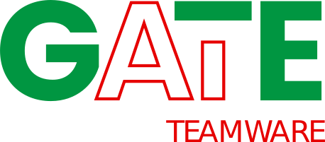

# GATE Teamware

A web application for collaborative document annotation.

This is a documentation for Teamware version: <strong><DisplayVersion></DisplayVersion></strong>

## Key Features
* Free and open source software.
* Configure annotation options using a highly flexible JSON config.
* Set limits on proportions of a task that annotators can annotate.
* Import existing annotations as CSV or JSON.
* Export annotations as CSV or JSON.
* Annotation instructions and document rendering supports markdown and HTML.

## Getting started
A quickstart guide for annotators is [available here](annotatorguide).

To use an existing instance of GATE Teamware as a project manager or admin, find instructions in the [Managers and Admins guide](manageradminguide).

Documentation on deploying your own instance can be found in the [Developer Guide](developerguide).

## Bug reports and feature requests
Please make bug reports and feature requests as Issues on the [GATE Teamware GitHub repo](https://github.com/GATENLP/gate-teamware).

# Using Teamware
Teamware is developed by the [GATE](https://gate.ac.uk) team, an academic research group at The University of Sheffield. As a result, future funding relies on evidence of the impact that the software provides. If you use Teamware, please let us know using the contact form at [gate.ac.uk](https://gate.ac.uk/g8/contact). Please include details on grants, publications, commercial products etc. Any information that can help us to secure future funding for our work is greatly appreciated.

## Citation
For published work that has used Teamware, please cite this repository. One way is to include a citation such as:

> Karmakharm, T., Wilby, D., Roberts, I., & Bontcheva, K. (2022). GATE Teamware (Version 0.1.4) [Computer software]. https://github.com/GateNLP/gate-teamware

Please use the `Cite this repository` button at the top of the [project's GitHub repository](https://github.com/GATENLP/gate-teamware) to get an up to date citation.

The Teamware version can be found on the 'About' page of your Teamware instance.
